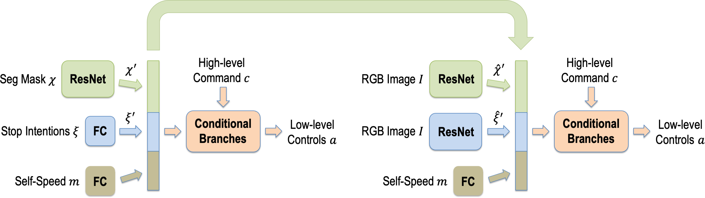

# SAM: Squeeze-and-Mimic Networks for Conditional Visual Driving Policy Learning

This repository is the official implementation of SAM: Squeeze-and-Mimic Networks for Conditional Visual Driving Policy Learning. It is built on top of [COiLTRAiNE](https://github.com/felipecode/coiltraine).


> [**SAM: Squeeze-and-Mimic Networks for Conditional Visual Driving Policy Learning**](https://arxiv.org/abs/1912.02973)  
> Albert Zhao, Tong He, Yitao Liang, Haibin Huang, Guy Van den Broeck, Stefano Soatto  
> [Conference on Robot Learning](https://www.robot-learning.org) (CoRL 2020)

## Reference
If you find this code useful, please consider citing
```
@inproceedings{zhao2020sam,
  author    = {Albert Zhao and Tong He and Yitao Liang and Haibin Huang and Guy Van den Broeck and Stefano Soatto},
  title     = {SAM: Squeeze-and-Mimic Networks for Conditional Visual Driving Policy Learning},
  booktitle = {Conference on Robot Learning (CoRL)},
  year      = {2020},
}
@inproceedings{Codevilla2019ICCV,
    title = {Exploring the Limitations of Behavior Cloning for Autonomous Driving},
    author = {Codevilla, Felipe and Santana, Eder and López, Antonio M. and Gaidon, Adrien},
    booktitle = {Proceedings of the IEEE International Conference on Computer Vision (ICCV)},
    year = {2019}
}
```

## Video
For a summary of our work, please see our [video](https://youtu.be/ipKAMzmJpMs).

## Installation
We provide a conda environment with all the dependencies.
```
conda env create -f requirements.yaml
conda activate coiltraine
```
In addition, to evaluate driving models, build a Docker image of CARLA Gear, a single gear version of CARLA 0.8.4.  
First, download [CARLA Gear](https://drive.google.com/open?id=1X52PXqT0phEi5WEWAISAQYZs-Ivx4VoE) and install [Docker](https://carla.readthedocs.io/en/latest/build_docker/).  
Then, build the Docker image by running
```
git clone https://github.com/carla-simulator/carla.git <carla_folder>
cd <carla_folder>
git checkout cfc6ee6
git reset --hard
cd ../
docker image build -f <carla_folder>/Util/Docker/Release.Dockerfile -t carlagear <path-to-carlagear/>CarlaGear
```
If you are not using Ubuntu 16.04, modify the first line of the Release Dockerfile accordingly before running the final line above to build the Docker image.

## Data Collection
Data can be collected using the [CARLA 0.8.4 data collector](https://github.com/carla-simulator/data-collector). Both data collection and model evaluation use CARLA Gear, a single gear version of CARLA 0.8.4. 

After collecting the data, the RGB images and semantic segmentation should be cropped using vertical crop [90, 485] and resized to 200x88.

## General Training and Evaluation Command
First, define the folder containing the training and validation datasets.
```
export COIL_DATASET_PATH=<Path to where your dataset folders are>
```
For all commands below, the training dataset is assumed to be located at `COIL_DATASET_PATH/Town01_coiltraine` and the validation dataset is located at `COIL_DATASET_PATH/Town01_val`. To change these paths, change the experiment config files and the dataset command line arguments appropriately.

Then, to run training, validation, and evaluation, run
```
python3 coiltraine.py --gpus <gpu_id> --folder <config_folder> -vd <val_dataset> -de <driving_envs> --docker carlagear
```
In the command above,  
  * `--folder` specifies which config folder to use (`nocrash_segmaskinput_allintentions` and `nocrash_segmaskintentionrep_jointtrain_totallysepbranches` for the squeeze and mimic networks, respectively)
  * `-vd` specifies the validation dataset
  * `-de` specifies list of driving environments (ex: `NocrashTraining_Town01` for evaluating on Nocrash training settings).

Alternatively, to run just training and validation, run
```
python3 coiltraine.py --gpus <gpu_id> --folder <config_folder> -vd <val_dataset>
```
To run just evaluation, run
```
python3 coiltraine.py --gpus <gpu_id> --folder <config_folder> --no-train -de <driving_envs> --docker carlagear
```

## Squeeze Network Training and Evaluation
The squeeze network can be trained and evaluated on NoCrash by running
```
python3 coiltraine.py --gpus 0 --folder nocrash_segmaskinput_allintentions -vd Town01_val -de NocrashTraining_Town01 NocrashNewWeather_Town01 NocrashNewTown_Town02 NocrashNewWeatherTown_Town02 --docker carlagear
```

## Mimic Network Training and Evaluation
This stage depends on having a trained squeeze network. 

First, compute the squeeze network's latent representations on the training and validation datasets:
```
python3 compute_embeddings_main_args.py --gpus 0 -f nocrash_segmaskinput_allintentions -e resnet34segmaskinputallrealintentions10 -vd Town01_val -d Town01_coiltraine
```
Then, run training and evaluation on NoCrash for the mimic network:
```
python3 coiltraine.py --gpus 0 --folder nocrash_segmaskintentionrep_jointtrain_totallysepbranches -vd Town01_val -de NocrashTraining_Town01 NocrashNewWeather_Town01 NocrashNewTown_Town02 NocrashNewWeatherTown_Town02 --docker carlagear
```

## Pretrained Model Evaluation
We provide pretrained models for the squeeze and mimic networks. 

Download pretrained squeeze and mimic networks:
```
python3 tools/download_pretrained_models.py
```

Evaluate the squeeze network on NoCrash:
```
python3 coiltraine.py --gpus 0 --folder nocrash_segmaskinput_allintentions --no-train -de NocrashTraining_Town01 NocrashNewWeather_Town01 NocrashNewTown_Town02 NocrashNewWeatherTown_Town02 --docker carlagear
```

Evaluate the mimic network on NoCrash:
```
python3 coiltraine.py --gpus 0 --folder nocrash_segmaskintentionrep_jointtrain_totallysepbranches --no-train -de NocrashTraining_Town01 NocrashNewWeather_Town01 NocrashNewTown_Town02 NocrashNewWeatherTown_Town02 --docker carlagear
```

Evaluate the squeeze network on NoCrash demo routes:
```
python3 coiltraine.py --gpus 0 --folder nocrash_segmaskinput_allintentions --no-train -de NocrashTrainingDemo_Town01 NocrashNewWeatherDemo_Town01 NocrashNewTownDemo_Town02 NocrashNewWeatherTownDemo_Town02 --docker carlagear
```

Evaluate the mimic network on NoCrash demo routes:
```
python3 coiltraine.py --gpus 0 --folder nocrash_segmaskintentionrep_jointtrain_totallysepbranches --no-train -de NocrashTrainingDemo_Town01 NocrashNewWeatherDemo_Town01 NocrashNewTownDemo_Town02 NocrashNewWeatherTownDemo_Town02 --docker carlagear
```

## Evaluating on Traffic-school
We also provide code to evaluate models on our newly proposed Traffic-school benchmark. To evaluate a model on Traffic-school, first evaluate the model on NoCrash and then follow the instructions below.

To obtain the Traffic-school results corresponding to a model with a given config evaluated on a given driving environment, run
```
python3 compute_trafficschool.py -f <config_folder> -e <config_exp> -de <driving_env>
```
where `<config_folder>` is the config folder for the model, `<config_exp>` is the config file for the model, and `<driving_env>` is the corresponding NoCrash driving environment.

Sample command to evaluate the squeeze network on Traffic-school new town & weather
```
python3 compute_trafficschool.py -f nocrash_segmaskinput_allintentions -e resnet34segmaskinputallrealintentions10 -de NocrashNewWeatherTown_Town02
```

Sample command to evaluate the mimic network on Traffic-school new town & weather
```
python3 compute_trafficschool.py -f nocrash_segmaskintentionrep_jointtrain_totallysepbranches -e resnet34imnet10realintentionl2replossjointtraintotallysepbranches -de NocrashNewWeatherTown_Town02
```

